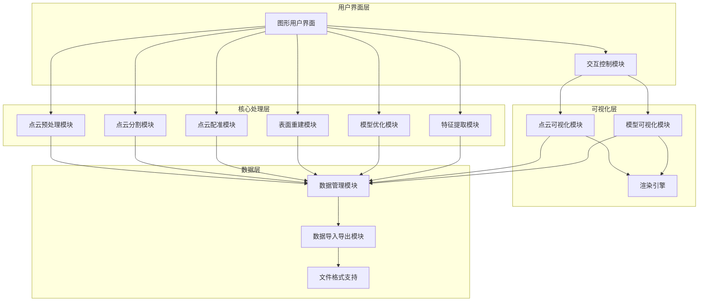

# 点云数据转CAD 3D模型系统开发需求文档

## 1. 项目概述

### 1.1 项目背景
随着工业自动化和智能制造的发展，点云数据在产品检测、逆向工程等领域的应用越来越广泛。各种3D扫描设备（如激光扫描仪、结构光扫描仪、深度相机等）能够快速获取物体表面的高精度点云数据，但如何将这些点云数据高效地转换为可用的CAD 3D模型，仍然是一个技术挑战。本项目旨在开发一套完整的系统，实现从点云数据到CAD 3D模型的自动化转换，并提供直观的交互处理和可视化重建功能。

### 1.2 项目目标
- 开发一套完整的点云数据处理系统，支持导入多种来源的点云数据
- 实现点云数据的预处理、滤波、分割等交互处理功能
- 提供高效的点云到CAD 3D模型的自动转换算法
- 构建直观的可视化界面，支持点云数据和重建模型的实时预览
- 支持常见CAD格式的导出，确保与主流CAD软件的兼容性

### 1.3 术语定义
| 术语 | 解释 |
|------|------|
| 点云数据 | 由三维坐标点组成的数据集，每个点包含X、Y、Z坐标信息，有时还包含颜色等属性 |
| CAD | Computer-Aided Design，计算机辅助设计，用于创建、修改、分析和优化设计的软件系统 |
| 3D模型 | 用计算机表示的三维物体，包含几何形状、材质等信息 |
| 点云滤波 | 去除点云数据中的噪声和异常点的处理过程 |
| 点云分割 | 将点云数据按照一定规则（如几何特征、颜色等）划分为不同区域的过程 |
| 表面重建 | 从点云数据构建连续表面模型的过程 |
| 网格模型 | 由多边形（通常是三角形）组成的表面模型，表示3D物体的几何形状 |
| 点云配准 | 将多个不同视角获取的点云数据对齐到同一坐标系的过程 |
| 特征提取 | 从点云数据中提取具有代表性的特征点或特征描述子的过程 |
| 批量处理 | 同时处理多个点云文件的自动化过程 |

## 2. 功能需求

### 2.1 数据导入与导出
| 功能点 | 描述 | 优先级 |
|--------|------|--------|
| 点云数据导入 | 支持导入常见点云格式文件（如.ply、.obj、.xyz、.pcd、.las等） | 高 |
| 批量导入 | 支持批量导入多个点云文件，提高工作效率 | 中 |
| CAD模型导出 | 支持将重建的3D模型导出为常见CAD格式（如.step、.iges、.stl、.obj等） | 高 |
| 批量导出 | 支持批量导出多个模型文件，提高工作效率 | 中 |
| 数据格式转换 | 支持不同点云格式之间的相互转换 | 中 |

### 2.2 点云数据处理
| 功能点 | 描述 | 优先级 |
|--------|------|--------|
| 点云滤波 | 提供多种滤波算法（如统计滤波、半径滤波等），去除噪声点和异常点 | 高 |
| 点云采样 | 提供多种点云简化算法（如体素网格下采样、均匀采样、随机采样等），减少数据量同时保持几何特征 | 高 |
| 特征提取 | 提供点云特征提取算法（如FPFH、SHOT等），用于配准和识别 | 中 |
| 点云分割 | 支持多种点云分割算法（如平面分割、欧氏聚类分割、区域生长分割、RGB区域生长分割等），将点云划分为不同区域 | 高 |
| 点云配准 | 支持多种点云配准算法（如ICP、GICP、SAC-IA、NDT等），实现多视角点云数据的对齐和融合 | 高 |
| 点云补洞 | 支持对点云数据中的空洞进行自动或手动修补 | 中 |

### 2.3 3D模型重建
| 功能点 | 描述 | 优先级 |
|--------|------|--------|
| 表面重建 | 从点云数据构建连续的表面模型，支持多种重建算法（如泊松重建、贪婪三角化等） | 高 |
| 模型优化 | 对重建的3D模型进行优化，包括网格简化、平滑等操作 | 高 |
| 特征提取 | 自动提取模型的关键特征（如边缘、曲面等） | 中 |
| 参数化建模 | 支持将重建的自由曲面转换为参数化模型，便于后续编辑 | 中 |

### 2.4 可视化与交互
| 功能点 | 描述 | 优先级 |
|--------|------|--------|
| 点云可视化 | 实时显示点云数据，支持点大小、颜色等参数调整 | 高 |
| 模型可视化 | 实时显示重建的3D模型，支持材质、光照、渲染模式等调整 | 高 |
| 交互操作 | 支持鼠标/键盘交互，如旋转、平移、缩放等操作 | 高 |
| 多视图显示 | 提供多视图窗口和预设视角，同时显示不同角度的点云或模型 | 高 |
| 测量工具 | 提供距离、角度、面积、体积等测量工具 | 高 |
| 标注功能 | 支持在点云或模型上添加标注和注释 | 低 |

### 2.5 系统管理
| 功能点 | 描述 | 优先级 |
|--------|------|--------|
| 项目管理 | 支持创建、保存、加载项目文件，记录处理过程和参数设置 | 高 |
| 批处理功能 | 支持批量导入、处理和导出多个点云文件，提高工作效率 | 高 |
| 日志记录 | 记录系统操作日志，便于故障排查和过程追溯 | 中 |
| 系统设置 | 支持自定义系统参数，如默认文件路径、渲染设置等 | 低 |

## 3. 非功能需求

### 3.1 性能需求
| 需求点 | 描述 | 优先级 |
|--------|------|--------|
| 处理速度 | 对于中等规模的点云数据（约100万个点），预处理时间不超过30秒，重建时间不超过2分钟 | 高 |
| 内存使用 | 系统应能处理至少500万个点的点云数据，内存使用不超过8GB | 高 |
| 响应时间 | 交互操作的响应时间不超过0.5秒，确保用户体验流畅 | 高 |
| 并行处理 | 支持多核心并行处理，充分利用硬件资源 | 中 |

### 3.2 可靠性需求
| 需求点 | 描述 | 优先级 |
|--------|------|--------|
| 稳定性 | 系统应能稳定运行，无崩溃或异常退出情况 | 高 |
| 错误处理 | 提供友好的错误提示和处理机制，避免因用户操作失误导致系统故障 | 高 |
| 数据备份 | 自动备份处理过程中的临时数据，防止意外情况导致数据丢失 | 中 |

### 3.3 易用性需求
| 需求点 | 描述 | 优先级 |
|--------|------|--------|
| 用户界面 | 提供直观、美观的图形用户界面，操作流程简单明了 | 高 |
| 操作指引 | 提供详细的操作指南和上下文帮助，降低用户学习成本 | 高 |
| 快捷键支持 | 支持常用操作的快捷键，提高操作效率 | 中 |
| 自定义界面 | 支持用户自定义界面布局和工具栏配置 | 低 |

### 3.4 兼容性需求
| 需求点 | 描述 | 优先级 |
|--------|------|--------|
| 操作系统 | 支持Windows 10/11 64位操作系统 | 高 |
| 硬件兼容性 | 支持主流的CPU和GPU配置，针对高性能GPU提供加速支持 | 高 |
| 软件兼容性 | 与主流CAD软件（如AutoCAD、SolidWorks、CATIA等）导出的模型格式兼容 | 高 |
| 数据格式 | 支持常见的点云格式和CAD模型格式 | 高 |

### 3.5 可扩展性需求
| 需求点 | 描述 | 优先级 |
|--------|------|--------|
| 插件系统 | 提供插件接口，支持功能扩展和自定义算法集成 | 中 |
| 模块化设计 | 采用模块化设计，便于后续功能扩展和维护 | 高 |
| API接口 | 提供API接口，支持与其他系统的集成 | 中 |

## 4. 技术架构

### 4.1 系统架构
系统采用分层架构设计，包括数据层、核心处理层、可视化层和用户界面层。

### 4.2 技术选型
| 技术/库 | 用途 | 版本 | 优先级 |
|---------|------|------|--------|
| C++ | 核心算法实现，保证处理性能 | C++17 | 高 |
| Qt | 跨平台GUI开发，提供用户界面 | 5.15+ | 高 |
| PCL (Point Cloud Library) | 点云数据处理，提供丰富的点云算法 | 1.12+ | 高 |
| CGAL (Computational Geometry Algorithms Library) | 计算几何算法，用于表面重建和优化 | 5.4+ | 中 |
| Assimp | 3D模型导入导出，支持多种文件格式 | 5.1+ | 中 |
| OpenGL | 底层图形渲染，支持高性能可视化 | 4.5+ | 高 |
| Eigen3 | 线性代数库，用于矩阵运算 | 3.3+ | 高 |
| Boost | 通用工具库，提供各种辅助功能 | 1.70+ | 中 |

### 4.3 关键技术
1. **点云滤波算法**：结合统计滤波、半径滤波等多种方法，有效去除噪声点和异常点。
2. **点云采样技术**：实现体素网格下采样、均匀采样、随机采样等多种采样方法，平衡数据量和几何特征。
3. **特征提取技术**：实现FPFH、SHOT等点云特征提取算法，提高配准和识别精度。
4. **点云分割技术**：基于平面分割、欧氏聚类、区域生长等多种算法，实现点云的自动分割。
5. **点云配准技术**：结合ICP、GICP、SAC-IA、NDT等多种配准算法，实现高精度点云对齐。
6. **表面重建算法**：采用泊松重建、贪婪三角化等算法，从点云数据构建连续表面。
7. **模型优化技术**：通过移动最小二乘平滑等操作，优化重建模型的质量和效率。
8. **实时可视化**：利用OpenGL和现代渲染技术，实现点云数据和模型的实时显示。
9. **批量处理技术**：支持批量导入、处理和导出多个点云文件，提高工作效率。
10. **项目管理技术**：实现项目文件的创建、保存和加载，记录处理过程和参数设置。

## 5. 开发计划

### 5.1 项目阶段
| 阶段 | 时间 | 主要任务 |
|------|------|----------|
| 需求分析与设计 | 1个月 | 完成需求分析，确定系统架构和技术选型，制定详细设计方案 |
| 核心功能开发 | 3个月 | 实现数据导入导出、点云预处理、分割、配准等核心功能 |
| 可视化与交互开发 | 2个月 | 开发点云可视化、模型可视化和用户交互界面 |
| 重建与优化开发 | 2个月 | 实现表面重建、模型优化和特征提取功能 |
| 测试与优化 | 1个月 | 系统测试、性能优化和bug修复 |
| 文档与交付 | 1个月 | 编写用户手册、技术文档，完成最终交付 |

### 5.2 里程碑
| 里程碑 | 时间 | 完成标准 |
|--------|------|----------|
| 需求规格说明书完成 | 第2周 | 完成详细的需求规格说明书，包括功能需求和非功能需求 |
| 系统架构设计完成 | 第4周 | 完成系统架构设计文档，确定技术选型和模块划分 |
| 核心模块开发完成 | 第16周 | 完成数据处理、点云算法等核心模块的开发和测试 |
| 可视化系统开发完成 | 第24周 | 完成可视化界面和交互系统的开发，实现实时显示功能 |
| 系统集成完成 | 第28周 | 完成各模块的集成测试，确保系统功能正常 |
| 性能优化完成 | 第32周 | 完成系统性能优化，达到设计要求的处理速度和内存使用标准 |
| 最终交付 | 第36周 | 完成所有开发任务，提交最终产品和文档 |

## 6. 测试计划

### 6.1 测试策略
- **单元测试**：对每个模块的核心功能进行单独测试，确保算法正确性。
- **集成测试**：测试模块之间的交互和数据流转，确保系统整体功能正常。
- **性能测试**：测试系统在不同规模点云数据下的处理速度和内存使用情况。
- **兼容性测试**：测试系统在不同硬件配置和操作系统下的运行情况。
- **用户测试**：邀请目标用户进行实际操作测试，收集反馈并优化用户体验。

### 6.2 测试用例
| 测试用例 | 测试内容 | 预期结果 |
|----------|----------|----------|
| 点云数据导入 | 导入不同格式的点云文件 | 成功导入并正确显示点云数据 |
| 点云滤波 | 对含噪声的点云数据应用滤波算法 | 噪声点被有效去除，保留几何特征 |
| 点云分割 | 对复杂点云数据应用分割算法 | 点云被正确分割为不同区域 |
| 表面重建 | 从点云数据重建表面模型 | 生成连续、平滑的表面模型 |
| 模型优化 | 对重建模型应用优化算法 | 模型质量提高，数据量减少 |
| CAD模型导出 | 导出重建模型为不同CAD格式 | 导出文件可在主流CAD软件中正确打开 |
| 可视化性能 | 测试大规模点云数据的显示性能 | 实时显示，无明显卡顿 |
| 系统稳定性 | 长时间运行系统，执行各种操作 | 系统稳定运行，无崩溃或异常 |

## 7. 风险管理

### 7.1 风险识别
| 风险 | 描述 | 可能性 | 影响 | 应对措施 |
|------|------|--------|------|----------|
| 算法性能不足 | 点云处理和重建算法在大规模数据下性能不足 | 中 | 高 | 优化算法实现，利用GPU加速，采用增量处理策略 |
| 重建精度不达标 | 重建的3D模型精度不符合预期要求 | 中 | 高 | 调研和实现更先进的重建算法，优化参数设置 |
| 系统兼容性问题 | 系统在不同硬件或软件环境下运行异常 | 低 | 中 | 进行充分的兼容性测试，提供详细的系统要求说明 |
| 开发时间延误 | 项目开发进度延误，影响交付时间 | 中 | 中 | 制定详细的开发计划，定期监控进度，及时调整资源分配 |
| 技术难点未攻克 | 某些核心技术难点无法在预期时间内攻克 | 低 | 高 | 提前进行技术预研，必要时寻求外部专家支持 |

### 7.2 风险监控
- 定期召开项目进度会议，评估风险状态
- 建立风险跟踪矩阵，记录风险发生情况和应对措施效果
- 对高风险项进行重点监控，及时调整应对策略

## 8. 交付物

### 8.1 软件交付物
- 完整的点云数据转CAD 3D模型系统安装包
- 系统源代码
- 系统API文档

### 8.2 文档交付物
- 开发需求文档
- 技术架构与实现方案文档
- README.md项目说明文档
- 用户操作手册
- 测试报告

### 8.3 其他交付物
- 演示视频
- 培训材料

## 9. 项目团队

### 9.1 团队组成
| 角色 | 职责 | 人数 |
|------|------|------|
| 项目经理 | 负责项目规划、协调和管理 | 1 |
| 算法工程师 | 负责点云处理和重建算法的设计与实现 | 2 |
| 软件工程师 | 负责系统架构设计和核心功能开发 | 2 |
| 可视化工程师 | 负责系统可视化和用户界面开发 | 1 |
| 测试工程师 | 负责系统测试和质量保证 | 1 |

### 9.2 团队协作
- 采用敏捷开发方法，定期迭代和交付
- 使用版本控制系统（如Git）管理代码
- 建立项目管理工具（如Jira）跟踪任务和进度
- 定期召开团队会议，沟通项目进展和问题

## 10. 附录

### 10.1 参考资料
- 《点云处理与3D重建》
- 《计算机视觉：算法与应用》
- PCL官方文档
- Open3D官方文档
- CGAL官方文档

### 10.2 相关技术标准
- ISO 10303-21: 产品数据表示与交换标准
- ASTM E2945-14: 三维点云数据标准指南
- ISO/IEC 19776-1: 虚拟现实建模语言标准

### 10.3 缩略语表
| 缩略语 | 全称 | 解释 |
|--------|------|------|
| CAD | Computer-Aided Design | 计算机辅助设计 |
| PCL | Point Cloud Library | 点云库 |
| CGAL | Computational Geometry Algorithms Library | 计算几何算法库 |
| GPU | Graphics Processing Unit | 图形处理单元 |
| CPU | Central Processing Unit | 中央处理单元 |
| API | Application Programming Interface | 应用程序编程接口 |
| IO | Input/Output | 输入/输出 |
| GUI | Graphical User Interface | 图形用户界面 |