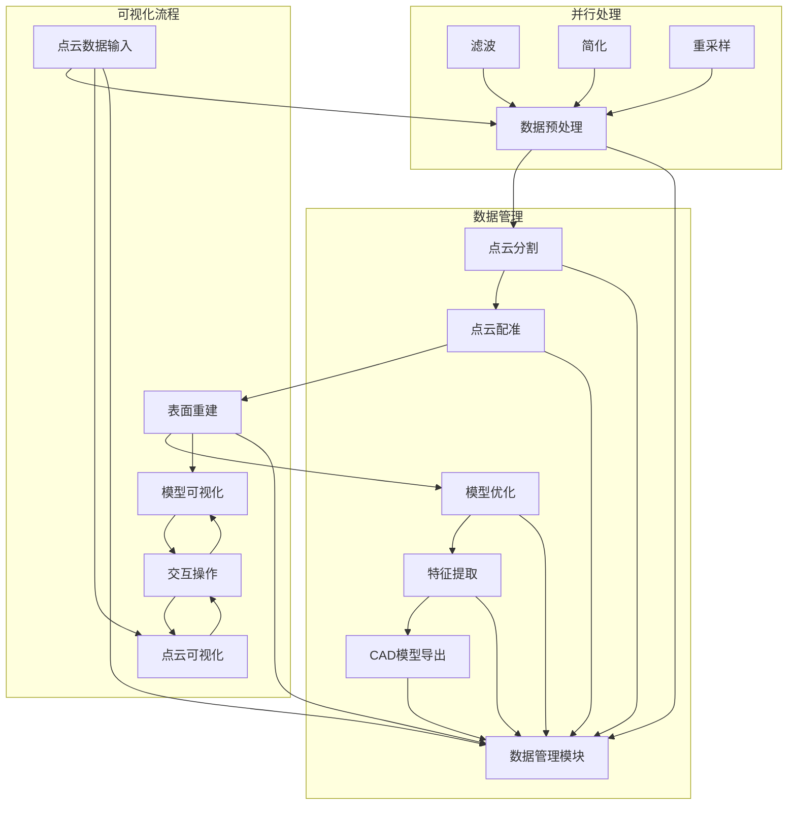

# 点云数据转CAD 3D模型系统技术架构与实现方案

## 1. 技术架构设计

### 1.1 系统分层

系统采用模块化、分层架构设计，确保各组件之间的低耦合、高内聚，便于后续的维护和扩展。具体分层如下：

| 层级 | 模块名称 | 主要职责 | 技术选型 |
|------|---------|----------|----------|
| 数据层 | 数据导入导出模块 | 处理不同格式的点云数据和CAD模型的读写操作 | C++、Assimp、PCL IO模块 |
| 数据层 | 数据管理模块 | 管理点云数据和模型数据的内存存储与访问 | C++、STL容器 |
| 核心处理层 | 点云预处理模块 | 实现点云滤波、简化、重采样等操作 | C++、PCL |
| 核心处理层 | 点云分割模块 | 实现点云的区域分割和语义分割 | C++、PCL、CGAL |
| 核心处理层 | 点云配准模块 | 实现多视角点云的对齐和融合 | C++、PCL |
| 核心处理层 | 表面重建模块 | 从点云数据构建连续表面模型 | C++、PCL、CGAL |
| 核心处理层 | 模型优化模块 | 对重建模型进行网格简化、平滑等优化 | C++、CGAL |
| 核心处理层 | 特征提取模块 | 提取模型的几何特征和结构信息 | C++、PCL、CGAL |
| 可视化层 | 点云可视化模块 | 实现点云数据的实时渲染和显示 | C++、Qt、OpenGL |
| 可视化层 | 模型可视化模块 | 实现3D模型的实时渲染和显示 | C++、Qt、OpenGL |
| 可视化层 | 渲染引擎 | 提供统一的渲染接口和底层渲染功能 | C++、OpenGL |
| 用户界面层 | 图形用户界面 | 提供直观的用户操作界面 | C++、Qt |
| 用户界面层 | 交互控制模块 | 处理用户输入和界面交互逻辑 | C++、Qt |

### 1.2 核心模块设计

#### 1.2.1 数据导入导出模块

**功能**：支持导入常见点云格式文件；支持将重建的3D模型导出为常见CAD格式；支持批量导入导出功能。

**实现方案**：
- 使用PCL库的IO模块处理点云文件的读写
- 使用Assimp库处理CAD模型文件的读写
- 支持的文件格式：
  - 点云格式：.ply、.obj、.xyz、.pcd、.las
  - CAD模型格式：.step、.iges、.stl、.obj

#### 1.2.2 点云预处理模块

**功能**：对原始点云数据进行滤波、简化、重采样等操作，提高后续处理的效率和精度。

**实现方案**：
- 实现多种滤波算法：
  - 统计滤波：去除离群点
  - 半径滤波：去除稀疏区域的点
  - 高斯滤波：平滑点云
  - 条件滤波：根据特定条件过滤点
- 实现点云简化算法：
  - 随机采样：随机减少点云数量
  - 体素网格下采样：保持几何特征的同时减少点云数量
  - 均匀采样：均匀减少点云数量
- 实现点云重采样算法：
  - 基于距离的重采样
  - 基于密度的重采样

#### 1.2.3 点云分割模块

**功能**：将点云数据按照几何特征、颜色等划分为不同区域，便于后续的单独处理。

**实现方案**：
- 实现基于几何特征的分割：
  - 平面分割：提取平面区域
  - 圆柱体分割：提取圆柱体区域
  - 球体分割：提取球体区域
  - 区域生长分割：基于点的相似性进行分割
- 实现基于颜色的分割：
  - 基于RGB颜色空间的分割
  - 基于HSV颜色空间的分割
- 实现基于聚类的分割：
  - K-means聚类
  - DBSCAN聚类

#### 1.2.4 点云配准模块

**功能**：将多个视角获取的点云数据对齐到同一坐标系，构建完整的物体模型。

**实现方案**：
- 实现粗配准算法：
  - SAC-IA（采样一致性初始对齐）
  - Fast Global Registration
- 实现精配准算法：
  - ICP（迭代最近点）及其变体
  - Generalized ICP
  - Normal Distributions Transform (NDT)
- 实现多视角配准策略：
  - 顺序配准
  - 全局配准

#### 1.2.5 表面重建模块

**功能**：从点云数据构建连续、平滑的表面模型。

**实现方案**：
- 实现基于网格的重建算法：
  - 泊松重建：适合密集点云，生成封闭表面
  - 移动立方体算法：适合规则点云
  - Delaunay三角化：适合稀疏点云
- 实现基于隐函数的重建算法：
  - 径向基函数(RBF)重建
  - 水平集方法
- 实现参数化重建算法：
  - 贝塞尔曲面拟合
  - NURBS曲面拟合

#### 1.2.6 模型优化模块

**功能**：对重建的模型进行优化，提高模型质量和减少数据量。

**实现方案**：
- 实现网格简化算法：
  - 边折叠算法
  - 二次误差度量简化
  - 基于法线的简化
- 实现网格平滑算法：
  - 拉普拉斯平滑
  - 双边滤波平滑
  - 各向异性扩散平滑
- 实现网格修复算法：
  - 孔洞填充
  - 网格简化
  - 自交修复

#### 1.2.7 特征提取模块

**功能**：提取模型的几何特征和结构信息，为后续的参数化建模和编辑提供基础。

**实现方案**：
- 实现几何特征提取：
  - 边缘提取
  - 角点提取
  - 曲率估计
  - 法线估计
- 实现结构特征提取：
  - 平面检测与拟合
  - 曲面检测与拟合
  - 特征线提取
- 实现拓扑特征提取：
  - 连通分量分析
  - 边界提取
  - 拓扑结构分析

#### 1.2.8 可视化模块

**功能**：实现点云数据和3D模型的实时渲染和交互显示。

**实现方案**：
- 使用Qt作为GUI框架，提供跨平台的用户界面
- 使用OpenGL作为底层渲染API，实现高性能图形渲染
- 实现以下可视化功能：
  - 点云渲染：支持点大小、颜色调整
  - 模型渲染：支持网格着色、材质、光照效果
  - 多视图显示：同时显示不同角度的点云或模型
  - 测量工具：距离、角度、面积、体积测量
  - 标注功能：在点云或模型上添加标注

### 1.3 系统流程图



## 2. 核心算法实现方案

### 2.1 点云滤波算法

#### 2.1.1 统计滤波
- **原理**：对每个点，计算其周围k个最近邻点的平均距离，然后根据统计分析去除距离异常的点。
- **实现**：使用PCL库的`pcl::StatisticalOutlierRemoval`类。
- **参数**：
  - `mean_k`：用于计算平均距离的最近邻点数量
  - `std_dev_mul_thresh`：标准差倍数阈值，超过此值的点被视为异常点

#### 2.1.2 半径滤波
- **原理**：对每个点，计算其在指定半径范围内的邻点数量，去除邻点数量少于阈值的点。
- **实现**：使用PCL库的`pcl::RadiusOutlierRemoval`类。
- **参数**：
  - `radius_search`：搜索半径
  - `min_pts_radius`：最小邻点数量阈值

#### 2.1.3 高斯滤波
- **原理**：对每个点，根据其邻点的距离加权平均来平滑点云。
- **实现**：使用PCL库的`pcl::MovingLeastSquares`类，设置高斯核函数。
- **参数**：
  - `search_radius`：搜索半径
  - `polynomial_order`：多项式拟合阶数

### 2.2 点云分割算法

#### 2.2.1 平面分割
- **原理**：使用随机采样一致性(RANSAC)算法拟合平面模型，然后提取符合模型的点。
- **实现**：使用PCL库的`pcl::SACSegmentation`类。
- **参数**：
  - `model_type`：设置为`SACMODEL_PLANE`
  - `method_type`：设置为`SAC_RANSAC`
  - `distance_threshold`：距离阈值
  - `max_iterations`：最大迭代次数

#### 2.2.2 区域生长分割
- **原理**：从种子点开始，根据点的法线和曲率相似性逐步生长区域。
- **实现**：使用PCL库的`pcl::RegionGrowing`类。
- **参数**：
  - `number_of_neighbors`：邻点数量
  - `smoothness_threshold`：法线夹角阈值
  - `curvature_threshold`：曲率阈值

### 2.3 点云配准算法

#### 2.3.1 ICP配准
- **原理**：迭代计算两个点云之间的最优刚体变换，使对应点对的距离最小化。
- **实现**：使用PCL库的`pcl::IterativeClosestPoint`类。
- **参数**：
  - `max_iterations`：最大迭代次数
  - `transformation_epsilon`：变换收敛阈值
  - `euclidean_fitness_epsilon`：欧氏距离收敛阈值

#### 2.3.2 NDT配准
- **原理**：使用正态分布变换将点云转换为概率密度函数，然后通过优化找到最优变换。
- **实现**：使用PCL库的`pcl::NormalDistributionsTransform`类。
- **参数**：
  - `resolution`：体素网格分辨率
  - `step_size`：优化步长
  - `transformation_epsilon`：变换收敛阈值

### 2.4 表面重建算法

#### 2.4.1 泊松重建
- **原理**：使用泊松方程从点云数据中重建隐函数，然后通过等值面提取生成网格模型。
- **实现**：使用PCL库的`pcl::Poisson`类。
- **参数**：
  - `depth`：重建树的深度
  - `point_weight`：点的权重
  - `scale`：点云尺度

#### 2.4.2 贪婪三角化
- **原理**：基于局部邻域信息，逐步构建三角形网格。
- **实现**：使用PCL库的`pcl::GreedyProjectionTriangulation`类。
- **参数**：
  - `search_radius`：搜索半径
  - `mu`：距离乘数
  - `maximum_nearest_neighbors`：最大邻点数量
  - `maximum_surface_angle`：最大表面角度

### 2.5 模型优化算法

#### 2.5.1 网格简化
- **原理**：使用边折叠算法减少网格中的三角形数量，同时保持模型的几何特征。
- **实现**：使用CGAL库的`CGAL::Surface_mesh_simplification`模块。
- **参数**：
  - `stop_ratio`：简化比例
  - `cost`：边折叠成本计算方法
  - `placement`：新顶点位置计算方法

#### 2.5.2 网格平滑
- **原理**：通过调整顶点位置，减少网格的噪声和不规则性。
- **实现**：使用CGAL库的`CGAL::Smoothing_kernel`模块。
- **参数**：
  - `number_of_iterations`：迭代次数
  - `time_step`：时间步长
  - `boundary_preservation`：边界保持选项

## 3. 技术实现细节

### 3.1 数据结构设计

#### 3.1.1 点云数据结构

使用PCL库的`pcl::PointCloud`模板类存储点云数据，支持不同类型的点：

- `pcl::PointXYZ`：仅包含三维坐标
- `pcl::PointXYZRGB`：包含三维坐标和颜色信息
- `pcl::PointNormal`：包含三维坐标和法线信息
- `pcl::PointXYZRGBNormal`：包含三维坐标、颜色和法线信息

#### 3.1.2 模型数据结构

使用CGAL库的`CGAL::Surface_mesh`类存储网格模型数据，或使用PCL库的`pcl::PolygonMesh`类。

#### 3.1.3 特征数据结构

自定义特征数据结构，存储提取的几何特征：

```cpp
// 边缘特征结构
struct EdgeFeature {
    pcl::PointXYZ start_point;
    pcl::PointXYZ end_point;
    float length;
    std::vector<pcl::PointXYZ> points; // 边缘上的点
};

// 平面特征结构
struct PlaneFeature {
    Eigen::Vector4f coefficients; // 平面方程系数
    pcl::PointCloud<pcl::PointXYZ>::Ptr points; // 平面上的点
    float area; // 平面面积
};

// 曲面特征结构
struct SurfaceFeature {
    std::string type; // 曲面类型：球面、圆柱面等
    Eigen::VectorXf parameters; // 曲面参数
    pcl::PointCloud<pcl::PointXYZ>::Ptr points; // 曲面上的点
};
```

### 3.2 并行计算实现

为提高处理速度，使用以下并行计算技术：

#### 3.2.1 多线程处理

使用C++11的`std::thread`和`std::async`实现多线程并行处理：

```cpp
// 示例：多线程进行点云滤波
void parallelFilter(pcl::PointCloud<pcl::PointXYZ>::Ptr cloud, std::vector<pcl::PointCloud<pcl::PointXYZ>::Ptr>& results) {
    // 创建多个线程，每个线程处理点云的一部分
    std::vector<std::future<void>> futures;
    int num_threads = std::thread::hardware_concurrency();
    int chunk_size = cloud->size() / num_threads;
    
    for (int i = 0; i < num_threads; ++i) {
        int start = i * chunk_size;
        int end = (i == num_threads - 1) ? cloud->size() : (i + 1) * chunk_size;
        
        futures.push_back(std::async(std::launch::async, [&, start, end, i]() {
            // 处理从start到end的点云数据
            // 将结果存储到results[i]
        }));
    }
    
    // 等待所有线程完成
    for (auto& future : futures) {
        future.wait();
    }
    
    // 合并处理结果
}
```

#### 3.2.2 GPU加速

对于计算密集型任务，使用CUDA实现GPU加速：

```cpp
// 示例：GPU加速的点云配准
__global__ void computeCorrespondencesKernel(float* source, float* target, int* correspondences, int source_size, int target_size) {
    // GPU上计算点云对应关系
}

void gpuRegister(pcl::PointCloud<pcl::PointXYZ>::Ptr source, pcl::PointCloud<pcl::PointXYZ>::Ptr target, Eigen::Matrix4f& transformation) {
    // 将点云数据复制到GPU内存
    // 调用CUDA kernel进行并行计算
    // 将结果从GPU内存复制回CPU
}
```

### 3.3 内存管理

为处理大规模点云数据，实现高效的内存管理策略：

1. **内存池**：预分配固定大小的内存池，避免频繁的内存分配和释放
2. **数据分块**：对大规模点云数据进行分块处理，减少内存使用
3. **延迟加载**：只加载当前需要处理的数据，其他数据存储在磁盘上
4. **智能指针**：使用`std::shared_ptr`和`std::unique_ptr`管理动态内存，避免内存泄漏

### 3.4 错误处理

实现完善的错误处理机制，确保系统稳定运行：

1. **异常处理**：使用C++异常处理机制捕获和处理错误
2. **错误码**：为每个函数定义错误码，便于错误追踪
3. **日志系统**：实现日志记录系统，记录错误信息和处理过程
4. **用户提示**：在GUI中显示友好的错误提示信息

### 3.5 性能优化

1. **算法优化**：选择高效的算法实现，避免不必要的计算
2. **数据结构优化**：使用适合的数据结构，提高数据访问效率
3. **缓存优化**：优化数据访问模式，提高缓存命中率
4. **编译优化**：使用编译器优化选项，如`-O3`、`-march=native`等
5. **并行优化**：充分利用多核CPU和GPU资源

## 4. 系统界面设计

### 4.1 主界面布局

主界面采用Qt框架设计，包含以下部分：

1. **菜单栏**：包含文件、编辑、视图、工具、帮助等菜单
2. **工具栏**：包含常用操作的快捷按钮
3. **左侧面板**：包含数据管理、参数设置等功能
4. **中央视图**：包含3D可视化区域，支持多视图显示
5. **右侧面板**：包含工具选项、测量结果等
6. **状态栏**：显示系统状态、处理进度等信息

### 4.2 主要界面模块

#### 4.2.1 数据导入导出界面

- 支持拖放文件导入
- 提供文件格式选择
- 显示导入进度和结果
- 支持批量导入导出

#### 4.2.2 点云处理界面

- 提供滤波、分割、配准等操作的参数设置
- 实时显示处理结果
- 支持处理前后的对比显示

#### 4.2.3 重建与优化界面

- 提供重建算法选择和参数设置
- 显示重建进度和结果
- 提供模型优化工具

#### 4.2.4 可视化控制界面

- 提供视角控制（旋转、平移、缩放）
- 提供显示模式控制（点大小、颜色、渲染模式）
- 提供光照和材质设置
- 提供多视图布局控制

#### 4.2.5 测量与标注界面

- 提供距离、角度、面积、体积测量工具
- 提供标注添加和编辑功能
- 显示测量结果和标注信息

## 5. 技术依赖与环境配置

### 5.1 核心依赖库

| 库名称 | 版本 | 用途 | 安装方式 |
|--------|------|------|----------|
| PCL | 1.12+ | 点云处理 | vcpkg或源码编译 |
| CGAL | 5.4+ | 计算几何 | vcpkg或源码编译 |
| Qt | 5.15+ | GUI开发 | 官方安装包 |
| OpenGL | 4.5+ | 图形渲染 | 系统内置 |
| Assimp | 5.1+ | 3D模型导入导出 | vcpkg或源码编译 |
| Eigen | 3.3+ | 线性代数 | vcpkg或源码编译 |
| Boost | 1.70+ | 通用工具库 | vcpkg或源码编译 |

### 5.2 开发环境配置

#### 5.2.1 Windows环境

1. **操作系统**：Windows 10/11 64位
2. **编译器**：Visual Studio 2019+ (MSVC 14.2+)
3. **构建工具**：CMake 3.16+
4. **依赖管理**：vcpkg

**环境配置步骤**：

1. 安装Visual Studio 2019+，选择C++开发工作负载
2. 安装CMake 3.16+
3. 安装vcpkg
4. 使用vcpkg安装依赖库：
   ```bash
   vcpkg install pcl:x64-windows
   vcpkg install cgal:x64-windows
   vcpkg install qt5:x64-windows
   vcpkg install assimp:x64-windows
   vcpkg install eigen3:x64-windows
   vcpkg install boost:x64-windows
   ```
5. 配置CMake项目，设置vcpkg工具链文件

#### 5.2.2 编译选项

**CMake编译选项**：

```cmake
# 启用C++17
set(CMAKE_CXX_STANDARD 17)
set(CMAKE_CXX_STANDARD_REQUIRED ON)

# 启用优化
set(CMAKE_BUILD_TYPE Release)
add_compile_options(/O2 /DNDEBUG)

# 启用多线程编译
add_compile_options(/MP)
```

## 6. 测试与验证方案

### 6.1 测试策略

1. **单元测试**：使用Google Test框架对核心算法和模块进行单元测试
2. **集成测试**：测试模块之间的交互和数据流转
3. **性能测试**：测试系统在不同规模点云数据下的处理速度和内存使用
4. **功能测试**：测试系统的各项功能是否正常工作
5. **用户测试**：邀请目标用户进行实际操作测试，收集反馈

### 6.2 测试用例

#### 6.2.1 点云处理测试

| 测试用例 | 输入数据 | 预期输出 | 测试方法 |
|----------|----------|----------|----------|
| 统计滤波 | 含噪声的点云数据 | 去除噪声点的点云数据 | 对比滤波前后的点云数据，检查噪声点是否被有效去除 |
| 半径滤波 | 稀疏区域的点云数据 | 去除稀疏区域点的点云数据 | 对比滤波前后的点云数据，检查稀疏区域的点是否被去除 |
| 平面分割 | 包含平面的点云数据 | 分割出的平面区域 | 检查分割结果是否正确提取了平面区域 |
| 点云配准 | 两个视角的点云数据 | 配准后的点云数据 | 检查配准后的点云是否正确对齐 |

#### 6.2.2 重建与优化测试

| 测试用例 | 输入数据 | 预期输出 | 测试方法 |
|----------|----------|----------|----------|
| 泊松重建 | 密集点云数据 | 封闭的表面模型 | 检查重建模型是否连续、封闭，是否保留了原始点云的几何特征 |
| 贪婪三角化 | 稀疏点云数据 | 三角形网格模型 | 检查重建模型是否正确表示了原始点云的形状 |
| 网格简化 | 高分辨率网格模型 | 低分辨率网格模型 | 检查简化后的模型是否保留了几何特征，三角形数量是否减少 |
| 网格平滑 | 粗糙网格模型 | 平滑网格模型 | 检查平滑后的模型是否减少了噪声和不规则性 |

#### 6.2.3 可视化测试

| 测试用例 | 输入数据 | 预期输出 | 测试方法 |
|----------|----------|----------|----------|
| 点云渲染 | 点云数据 | 可视化的点云 | 检查点云是否正确显示，颜色、大小是否可调整 |
| 模型渲染 | 网格模型 | 可视化的模型 | 检查模型是否正确显示，材质、光照效果是否正常 |
| 多视图显示 | 点云或模型数据 | 多个视角的显示 | 检查多视图是否同时正确显示 |
| 测量工具 | 点云或模型数据 | 测量结果 | 检查测量结果是否准确 |

### 6.3 性能测试指标

| 指标 | 测试方法 | 预期值 |
|------|----------|--------|
| 处理速度 | 测试不同规模点云数据的处理时间 | 100万点：预处理<30秒，重建<2分钟 |
| 内存使用 | 测试不同规模点云数据的内存使用 | 500万点：内存使用<8GB |
| 响应时间 | 测试交互操作的响应时间 | 交互操作响应<0.5秒 |
| 渲染帧率 | 测试点云或模型的渲染帧率 | 实时渲染帧率>30fps |

## 7. 项目管理与开发规范

### 7.1 版本控制

使用Git进行版本控制，遵循以下规范：

1. **分支管理**：
   - `master`：主分支，用于发布稳定版本
   - `develop`：开发分支，用于集成新功能
   - `feature/*`：功能分支，用于开发特定功能
   - `bugfix/*`：bug修复分支，用于修复问题

2. **提交规范**：
   - 提交信息格式：`[类型] 描述`
   - 类型包括：`feat`（新功能）、`fix`（bug修复）、`docs`（文档）、`style`（代码风格）、`refactor`（重构）、`test`（测试）、`chore`（构建/依赖）
   - 描述应简洁明了，说明提交的内容

### 7.2 代码规范

遵循以下代码规范：

1. **命名规范**：
   - 类名：使用驼峰命名法，首字母大写（如`PointCloudProcessor`）
   - 函数名：使用驼峰命名法，首字母小写（如`processPointCloud`）
   - 变量名：使用驼峰命名法或下划线命名法（如`pointCloud`或`point_cloud`）
   - 常量名：使用全大写字母，单词间用下划线分隔（如`MAX_ITERATIONS`）

2. **代码风格**：
   - 使用4个空格进行缩进
   - 大括号使用新行风格
   - 每行代码长度不超过100个字符
   - 函数长度不超过50行，超过则考虑拆分

3. **注释规范**：
   - 类和函数应有详细的文档注释
   - 复杂的算法和逻辑应有注释说明
   - 关键变量和常量应有注释说明

### 7.3 文档规范

1. **技术文档**：
   - 系统架构文档：描述系统的整体架构和模块划分
   - 算法文档：详细说明核心算法的原理和实现
   - API文档：描述系统的API接口和使用方法

2. **用户文档**：
   - 用户手册：详细说明系统的安装、配置和使用方法
   - 教程文档：提供系统使用的详细教程
   - 故障排除文档：提供常见问题的解决方案

### 7.4 开发工具

1. **IDE**：Visual Studio 2019+
2. **代码编辑器**：Visual Studio Code
3. **版本控制**：Git、GitHub/GitLab
4. **构建工具**：CMake
5. **包管理**：vcpkg
6. **测试框架**：Google Test
7. **文档工具**：Doxygen、Markdown

## 8. 风险评估与应对策略

### 8.1 技术风险

| 风险 | 可能性 | 影响 | 应对策略 |
|------|--------|------|----------|
| 点云处理算法性能不足 | 中 | 高 | 优化算法实现，使用GPU加速，采用增量处理策略 |
| 重建精度不达标 | 中 | 高 | 调研和实现更先进的重建算法，优化参数设置 |
| 系统兼容性问题 | 低 | 中 | 进行充分的兼容性测试，提供详细的系统要求说明 |
| 内存使用过高 | 中 | 中 | 实现数据分块处理，优化内存管理策略 |
| 可视化性能问题 | 中 | 中 | 使用更高效的渲染技术，优化可视化代码 |

### 8.2 应对策略

1. **技术预研**：在项目开始前，对核心技术进行预研和测试
2. **模块化设计**：采用模块化设计，便于替换和升级算法
3. **性能监控**：在开发过程中持续监控系统性能，及时发现和解决问题
4. **备份方案**：为关键算法和模块准备备份实现方案
5. **技术支持**：建立与开源社区的联系，获取技术支持

## 9. 结论与建议

### 9.1 技术可行性分析

基于当前的技术发展水平和可用的开源库，本项目的技术方案是可行的。PCL、CGAL、Qt、Open3D等库提供了丰富的功能和工具，可以满足系统的大部分需求。通过合理的架构设计和算法选择，可以实现一个高效、稳定的点云数据转CAD 3D模型系统。

### 9.2 实施建议

1. **分阶段实施**：按照开发计划分阶段实施，确保每个阶段的目标都能实现
2. **重点突破**：优先开发核心功能和算法，确保系统的基础能力
3. **持续优化**：在开发过程中持续优化系统性能和用户体验
4. **用户反馈**：及时收集用户反馈，调整系统功能和界面设计
5. **技术创新**：在现有技术基础上，探索新的算法和方法，提高系统的竞争力

### 9.3 未来展望

1. **AI集成**：引入人工智能技术，提高点云分割、特征提取等任务的自动化程度
2. **实时处理**：进一步优化系统性能，实现点云数据的实时处理和重建
3. **云端服务**：开发云端服务，支持大规模点云数据的处理和存储
4. **多平台支持**：扩展系统支持到Linux和macOS平台
5. **行业应用**：针对不同行业的需求，开发专用的点云处理和重建工具

通过本项目的实施，可以为点云数据的处理和应用提供一套完整的解决方案，促进工业自动化和智能制造的发展。